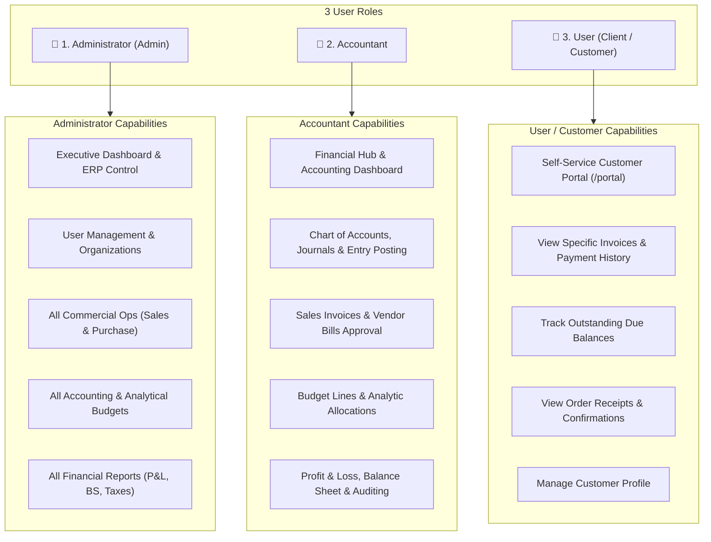

# FurniLedger: 3-Role Architecture & MySQL (XAMPP) Setup

## 1. System Role Breakdown (Flowchart Alignment)

Your project is structured around **3 distinct user roles**:

---

## 2. Updated Role Features Across the Project

### A. Sign In ([`LoginPage.jsx`](file:///e:/manav/fullwith%20sql/frontend/src/pages/LoginPage.jsx))
- **3-Role Toggle Switch**: Select between **Admin**, **Accountant**, and **User**.
- **Blank Fields by Default**: Login ID and Password fields start completely empty (`""`).
- **Dynamic Routing**:
  - `Administrator` &rarr; `/dashboard`
  - `Accountant` &rarr; `/dashboard`
  - `User` &rarr; `/portal`

### B. User Registration ([`CreateUserPage.jsx`](file:///e:/manav/fullwith%20sql/frontend/src/pages/CreateUserPage.jsx))
- Allows creating users with role selection: **User**, **Accountant**, or **Admin**.
- After creation, redirects to the Sign In page with a confirmation message and fresh, blank fields.

### C. Top Navigation Bar ([`Navbar.jsx`](file:///e:/manav/fullwith%20sql/frontend/src/components/Navbar.jsx))
- **Full Navigation Strip** for **Admin** and **Accountant**:
  - **Sales**: Sales Order, Sale Invoice, Receipt
  - **Purchase**: Purchase Order, Purchase Bill, Payment
  - **Account**: Contact, Product, Analytics, Analytical Budget, Chart of Account, Journals, Journal Entries
  - **Report**: Balance Sheet, Profit and Loss, Budget Report
- **Role Switcher**: Cycles dynamically between all 3 roles (**Admin** &harr; **Accountant** &harr; **User**).

---

## 3. Demo Credentials for All 3 Roles

| Role | Login ID | Email | Password | Access Area |
| :--- | :--- | :--- | :--- | :--- |
| **Administrator** | `admin_demo` | `admin@urbanfurniture.com` | `Password@123` | `/dashboard` (Executive ERP Hub) |
| **Accountant** | `accountant_demo` | `accountant@urbanfurniture.com` | `Password@123` | `/dashboard` (Accounting Hub) |
| **User** | `nimesh_user` | `nimesh.pathak@client.com` | `Password@123` | `/portal` (Customer Self-Service Portal) |

---

## 4. Verification

- **XAMPP MySQL Database**: Seeded and synchronized with all 3 role accounts.
- **Backend API Tests**: Passed 100% of modules (`npm run test:api`).
- **Frontend Production Build**: `npm run build` compiled cleanly in 2.91s with 0 errors.
